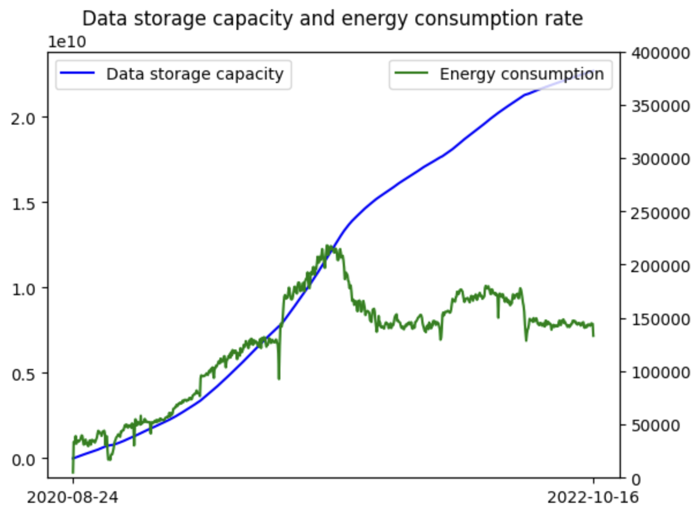
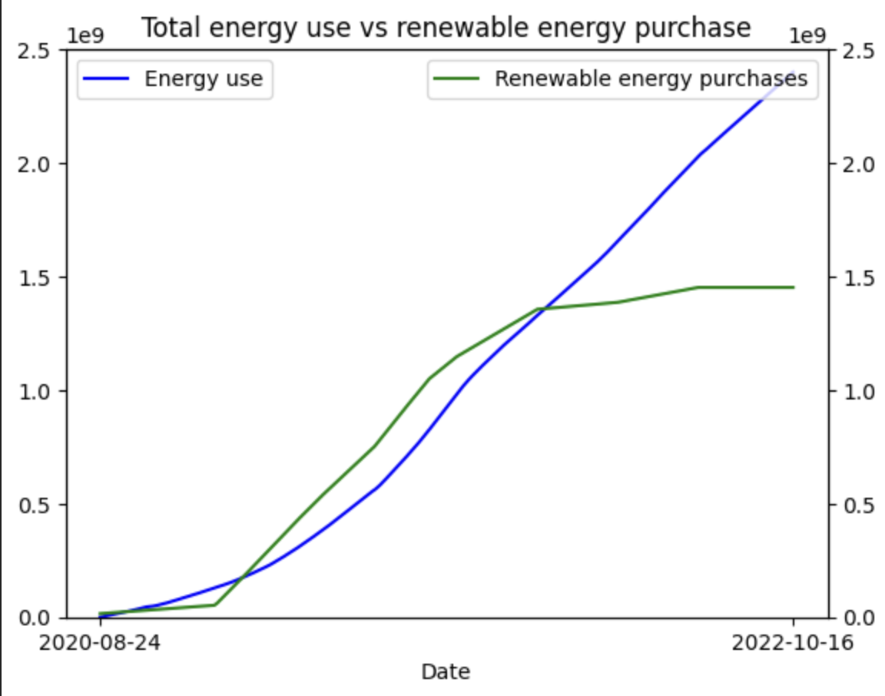
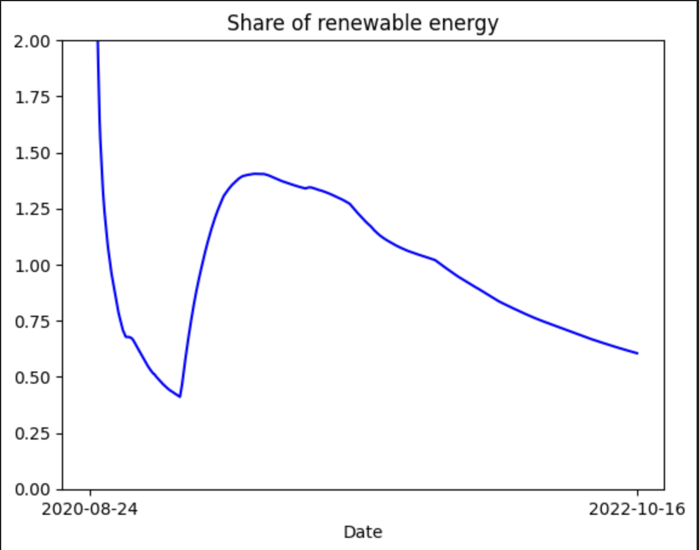
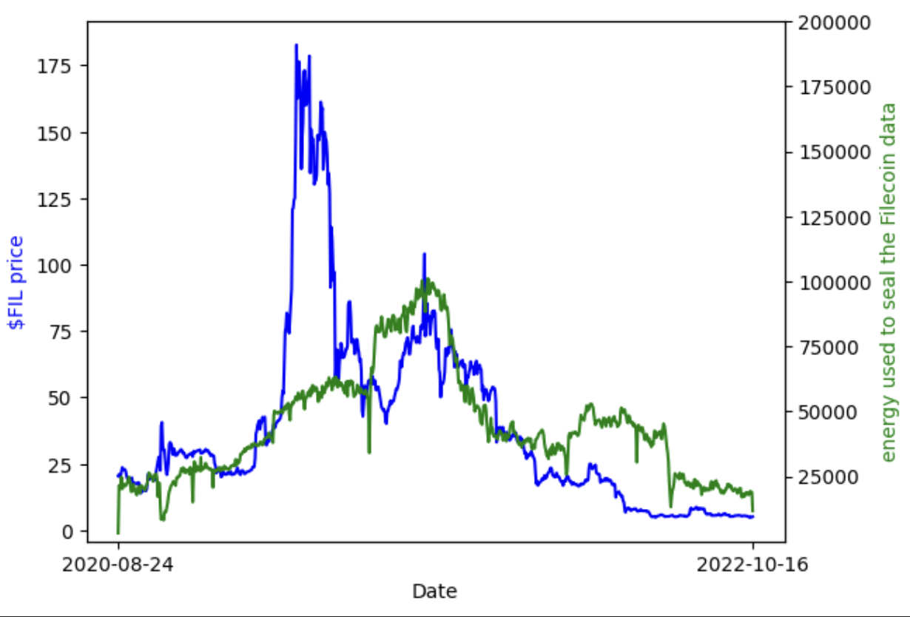
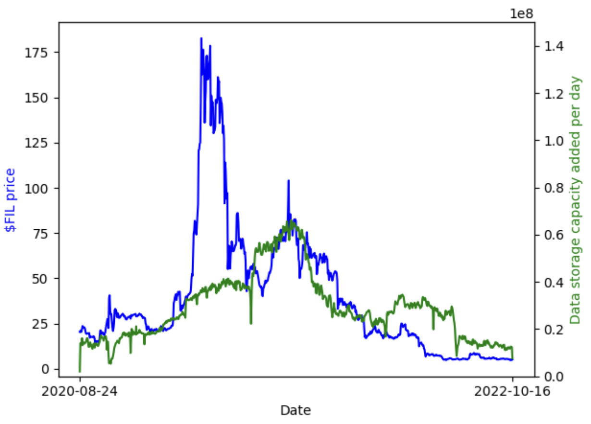
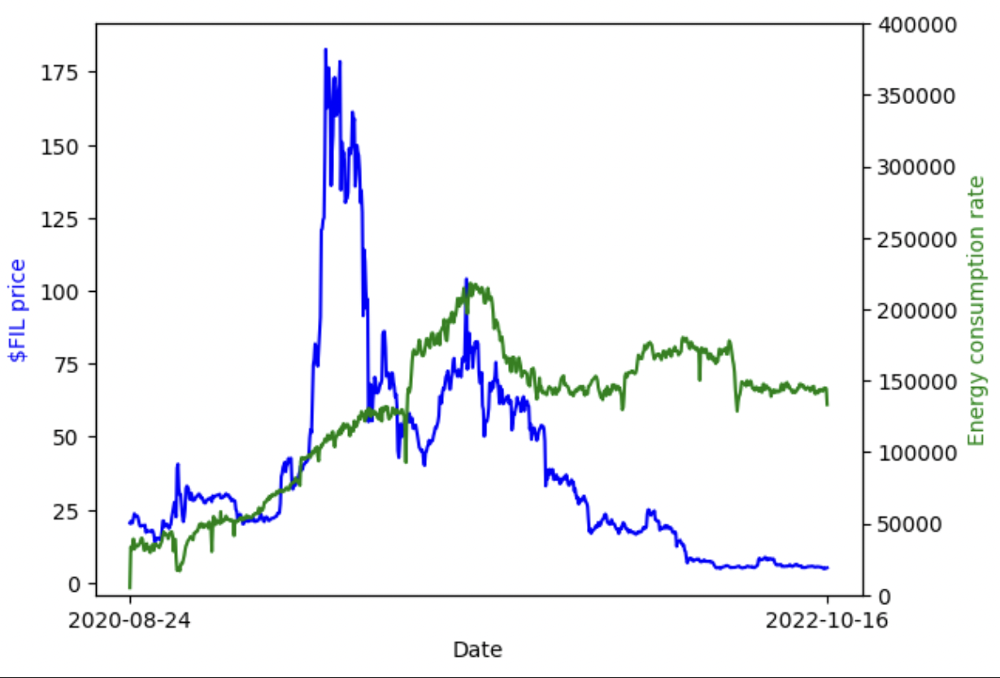

<h1>filecoin-ocean-analysis</h1>

<h2>Global analysis </h2>
<h3>Energy performance and the evolution of Filecoin's storage </h3>

     
     
This graph suggests the data storage capacity always increased since filecoin launched. The energy consumption rate was following the storage capacity in the first place but stoped evolving. This means that filecoin is getting more efficient to store data! 

<h3>Evolution of the share of renewable energy used by Filecoin</h3>

     
     

This shows that a huge part of the energy used is renewable (almost never under 50%), with a mean of 119.7482121194972%. The question is what is made with the energy purchased but not used ? 

We can observe that Filecoin seams to tend to be almost 100% renewable, even though we see the ratio of renewable is increasing more slowly at the end of this period.

<h2>Correlation</h2>
<h3>Between the energy used to seal the filecoin data and the price of the $FIL token </h3>

     
     

          
Pearson correlation (linear): 0.5836671865903877

          
Spearman correlation (non linear): 0.7209322840753908

          
This show a high correlation

     

<h3>Between the capacity of storage added per day in the Filecoin network and the price of the $FIL token </h3>

     
     

          
Pearson correlation (linear): 0.5836671865917777

          
Spearman correlation (non linear): 0.7209322840753908

          
This show a high correlation

     

<h3>Between the energy consumption rate of the Filecoin network and the $FIL token price </h3>

     
     

          
Pearson correlation (linear):-0.39090893851807507

          
Spearman correlation (non linear):-0.5233192039536365

          
This shows a slightly negative correlation

     

                                               
<h3>Conclusion of the correlations</h3>
The three correlations suggest that there is a positive relationship between higher price, and the energy used to seal the Filecoin data, as well as the data storage capacity added per day. This indicates that there is a high chance of augmentation of the capacity of storage added per day and energy used to seal data as we see the $FIL price increase. We would also see the energy consumption rate slightly decrease or not move, so the energy performance might be better in the future as well.

## Algorithm

## Report
